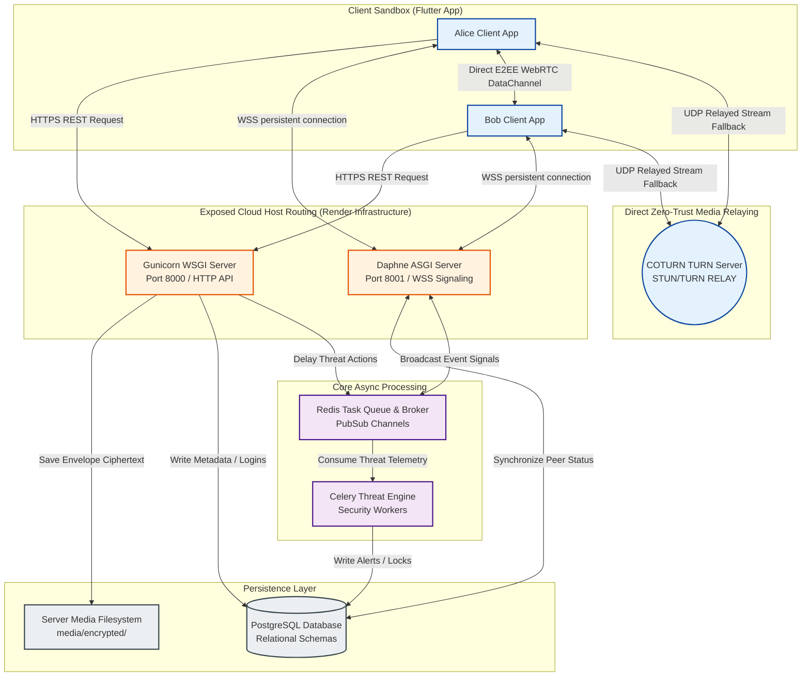
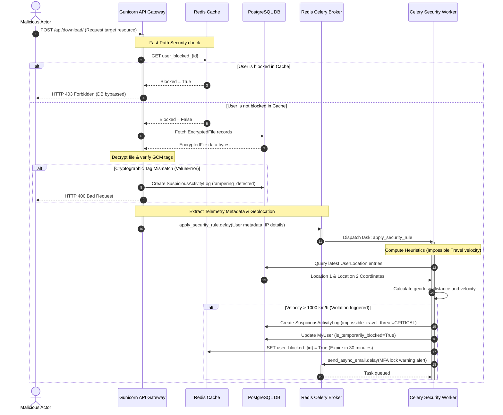

# SecureVault: Production System Architecture Specification
---

## 🏛️ Executive Summary

**SecureVault** is an enterprise-grade, high-security personal cloud vault and end-to-end encrypted (E2EE) peer-to-peer (P2P) file-sharing system. This document outlines the comprehensive **High-Level Design (HLD)** and **Low-Level Design (LLD)** specifications of the application, mapping out both client-side components (Flutter app running the BLoC/Repository pattern) and server-side components (Django REST Framework + Daphne ASGI + Celery + Redis). 

---

# PART 1: HIGH-LEVEL DESIGN (HLD)

## 1.1 System Overview & Core Capabilities

The architecture of SecureVault is designed around **Zero-Trust Relaying** and **Envelope Cryptography**. The system isolates file content from the server-side, serving either as a secure vault executing double-envelope key-wrapping or as a dumb signaling pipe for direct device-to-device streaming.

### Core Architecture Highlights:
*   **Dual-State Cryptographic Operation:** 
    *   **At Rest (Personal Vault):** Server-side envelope encryption. Files are locked using a random Data Encryption Key (DEK), which is wrapped using the server settings Key Encryption Key (KEK) and stored as a binary blob.
    *   **In Transit (P2P Share):** Client-side end-to-end encryption. File session keys are wrapped using the recipient's RSA-4096 public key, and chunks are signed via Ed25519 signatures, completely bypassing server-side visibility.
*   **Asynchronous SIEM-Inspired Guardrails:** A backend threat analysis engine utilizing Celery workers to asynchronously evaluate impossible travel speed, brute-force velocities, and unauthorized local access times, executing transient blocks in Redis.
*   **Constant-Memory Streaming Pipelines:** On both Python and Dart layers, files are processed sequentially in strict 16KB blocks, keeping active RAM capped at 1-2MB regardless of file size.

---

## 1.2 Component & Service Structural Topography

SecureVault’s architecture is divided into five distinct logical boundaries to enforce clear process separation, network isolation, and threat mitigation.

```
+---------------------------------------------------------------------------------+
|                                 CLIENT SANDBOX                                  |
|  +--------------------+   +---------------------------+   +------------------+  |
|  | Presentation Layer |   |   Business/Domain Layer   |   |    Data Layer    |  |
|  |    (BLoC State)    |   | (Use Cases & Repositories)|   | (Services/Local) |  |
|  +--------------------+   +---------------------------+   +------------------+  |
+----------------------------------------+----------------------------------------+
                                         | WSS / HTTPS (Directly to Cloud)
                                         v
+---------------------------------------------------------------------------------+
|                            PROTOCOL ROUTING LAYER                               |
|        +---------------------------------------------------------------+        |
|        |                  Render Hosting Infrastructure                 |        |
|        |  +---------------------------+   +-------------------------+  |        |
|        |  |  WSGI Gateway (Gunicorn)  |   | ASGI Gateway (Daphne)   |  |        |
|        |  +-------------+-------------+   +------------+------------+  |        |
|        +----------------|------------------------------|---------------+        |
+-------------------------|------------------------------|------------------------+
                          |                              | Channels PubSub
                          v                              v
+-----------------------------------+          +----------------------------------+
|      CORE APPLICATION SERVICES    |          |       ZERO-SERVER DATA PLANE     |
|  +-----------------------------+  |          |  +----------------------------+  |
|  |   UploadFileView REST API   |  |          |  |  WebRTC Direct DataChannel |  |
|  |   SignalingConsumer WS      |  |          |  |  (16KB chunks + GCM tags)  |  |
|  |   Celery Threat Engine      |  |          |  +-------------+--------------+  |
|  +--------------+--------------+  |          |                |                     |
+-----------------|-----------------+          |                v                     |
                  |                            |  +----------------------------+  |
                  v                            |  | COTURN STUN/TURN Relaying  |  |
+-----------------------------------+          |  |   (Zero-Knowledge Fallback)|  |
|     DATA & PERSISTENCE LAYER      |          |  +----------------------------+  |
|  +-----------------------------+  |          +----------------------------------+
|  | PostgreSQL Database         |  |
|  | Redis Temporary Cache       |  |
|  | Server Filesystem Disk      |  |
|  +-----------------------------+  |
+-----------------------------------+
```

### 1. High-Level Client Sandbox (Flutter App)
The client environment runs within a strict, hardware-secured sandbox. It leverages `FlutterSecureStorage` (interfacing with Apple Keychain or Android Keystore) to isolate private RSA and Ed25519 keys, while `SharedPreferences` caches short-lived JWT credentials.

### 2. Protocol Routing Layer (Render Host Gateways)
*Note: SecureVault operates without an Nginx proxy.* The cloud host (Render) acts as the entry routing gateway, exposing:
*   **Gunicorn (WSGI Gateway):** Routes incoming HTTPS/REST traffic (port 8000) directly to the Django application views.
*   **Daphne (ASGI Gateway):** Routes persistent WSS WebSockets traffic (port 8001) directly to the Django Channels protocol routers.
*   **COTURN Server:** Provides independent STUN/TURN servers to facilitate NAT traversal and relay encrypted peer payloads when direct P2P connection fails.

### 3. Core Application Services (Backend API & Signaling)
*   **Signaling Websocket Consumer:** Manages room passcodes, peer connectivity states, and routes wrapped asymmetric key parameters.
*   **Celery Threat Pipeline:** Evaluates telemetry metadata asynchronously, protecting database endpoints from being overwhelmed by security computations.

### 4. Data & Persistence Layer
*   **PostgreSQL:** Retains records for audit trials, user profile parameters, registered public keys, and progress synchronization (`FileTransfer` chunk tracking).
*   **Server Disk Storage:** Houses envelope-encrypted files on filesystem directories (`/media/encrypted/`) with scrubbed names.
*   **Redis Broker:** Handles Daphne WebSockets Channel Layer PubSub events and Celery task execution queues.

### 5. Zero-Server Data Plane (E2EE Transport)
The data plane runs completely off-server. File bytes are encrypted at the sender's client sandbox, streamed either directly P2P or via the COTURN server as a blind relay, and decrypted exclusively on the recipient's device. The server never holds the unwrapped file session key.

---

## 1.3 Protocol Boundaries & Interfaces

The network boundaries of SecureVault are strictly compartmentalized based on task sensitivities:

```
[Flutter Client A] ===( HTTPS / REST )========================> [Gunicorn REST Views]
    * User Registration, Session Authentication, Key Enrollment, Vault Storage Operations

[Flutter Client A] ===( WSS / WebSocket )======================> [Daphne ASGI Signaling]
    * Live Room Coordination, SDP Exchanges, ICE Candidate Swaps, Progress Acknowledgments

[Flutter Client A] ===( WebRTC DataChannel / UDP )============> [Flutter Client B] (Direct P2P)
    * E2EE File Chunk Transmission, Per-Chunk GCM Authentication, Index Verification

[Flutter Client A] ===( WebRTC Relay / TURN / TCP/UDP )=======> [COTURN Server] ===> [Flutter Client B]
    * Firewalled Fallback Tunneling, Zero-Knowledge Ciphertext Relaying
```

---

# PART 2: LOW-LEVEL DESIGN (LLD)

## 2.1 Flutter Client Architecture

The Flutter client enforces clean separation of concerns through the **BLoC (Business Logic Component)** and **Repository** patterns.

```
+-----------------------------------------------------------------------------------+
| PRESENTATION LAYER (UI & State Handlers)                                          |
|                                                                                   |
|    +------------------+       +-------------------+       +--------------------+  |
|    |     AuthBloc     |       |     RoomBloc      |       |  FileTransferBloc  |  |
|    +--------+---------+       +---------+---------+       +---------+----------+  |
+-------------|---------------------------|---------------------------|-------------+
              | Map AuthStates            | Map RoomStates            | Map TransferStates
              v                           v                           v
+-----------------------------------------------------------------------------------+
| BUSINESS / DOMAIN LAYER (Abstract Repositories & Use Cases)                      |
|                                                                                   |
|    +---------------------------------------------------------------------------+  |
|    |                        FileTransferRepository (Interface)                 |  |
|    +------------------------------------+--------------------------------------+  |
+-----------------------------------------|-----------------------------------------+
                                          | Polymorphic Implementation
                                          v
+-----------------------------------------------------------------------------------+
| DATA LAYER (Infrastructure Services & Implementations)                            |
|                                                                                   |
|  +------------------------------+   +--------------------+   +-----------------+  |
|  |  FileTransferRepositoryImpl  |-->|  WebSocketService  |-->|  WebRtcService  |  |
|  +--------------+---------------+   +--------------------+   +-----------------+  |
|                 |                                                                 |
|                 v                                                                 |
|  +------------------------------+                                                 |
|  |     CryptographyService      |                                                 |
|  +------------------------------+                                                 |
+-----------------------------------------------------------------------------------+
```

### 1. Presentation Layer (BLoCs)
*   **AuthBloc:** Manages application initialization, token refreshes, MFA validation states, and secure logout callbacks.
*   **RoomBloc:** Manages P2P session coordination states (joining, authentication of local peers, mapping room directories).
*   **FileTransferBloc:** Translates sequential progress streams (0.0 to 1.0) into reactive UI layouts (loaders, speed indicators, validation alerts).

### 2. Business/Domain Layer
*   Defines abstract interfaces and business rules (`FileTransferRepository`). Key entities (such as RSA public/private descriptors) remain platform-agnostic to support clean architectural boundaries.

### 3. Data Layer (Concrete Services & Repositories)
*   **FileTransferRepositoryImpl:** The core orchestrator. Manages local IOSink file streams, binds WebRTC connection streams to disk sinks, triggers signature checks, and dispatches progress updates.
*   **CryptographyService:** Interfaces with low-level algorithms (via point-conversion libraries) to execute SHA-256 streaming hashes, RSA-OAEP wrapping, and Ed25519 signature validations.
*   **WebSocketService & WebRtcService:** Manage physical network streams, ICE candidate queues, and direct SCTP data channel pipes.

### 4. Hardware-Backed Token & Private Key Persistence
*   **Credential Tokens (SharedPreferences):** Cache ephemeral JWT access and refresh tokens. Cached tokens are strictly bound to short-lived expiry windows.
*   **Private Cryptographic Keys (FlutterSecureStorage):** Asymmetric RSA private keys and Ed25519 private keys **never** enter plaintext storage. They are written directly to platform-level hardware keychains (iOS Keychain using data-protection API / Android Keystore backed by hardware security modules).
*   **Isolation on Logout:** To prevent cross-account key leakage (e.g., when multiple accounts use the same physical device/emulator), `AuthService.dart` runs a comprehensive wipe cycle during the logout sequence:
    ```dart
    // AuthService.dart - Safe Cleanup Sequence
    await _secureStorage.delete(key: 'rsa_modulus');
    await _secureStorage.delete(key: 'rsa_exponent');
    await _secureStorage.delete(key: 'ed25519_priv');
    await _secureStorage.delete(key: 'rsa_public_pem');
    await _secureStorage.delete(key: 'ed25519_pub');
    await _secureStorage.delete(key: 'access');
    await _secureStorage.delete(key: 'refresh');
    ```

---

## 2.2 Server-Side Cryptographic Envelope Design

The Django server enforces a zero-trust storage system for its personal cloud vault (`EncryptedFile` and `EncryptedImage` records). The database never stores the key used to encrypt the physical file in plaintext. Instead, it utilizes **Symmetric Envelope Wrapping**.

```
    [Upload Workflow: encrypt_file]

        +-----------------------+
        |   File Content Bytes  |
        +-----------+-----------+
                    |
                    v (AES-256-GCM using unique DEK + file_nonce)
        +-----------+-----------+     +-------------------+
        |      Ciphertext       |     |  file_tag (Auth)  |
        +-----------+-----------+     +-------------------+
                    |
                    +-------------> Written to Server Disk (/media/encrypted/)
  
  
        +-----------------------+     +-------------------+
        |  Random AES Key (DEK) |     | settings.MASTER_KEY | (KEK)
        +-----------+-----------+     +---------+---------+
                    |                           |
                    +-------------+-------------+
                                  v (AES-256-GCM wrapping using KEK + key_wrap_nonce)
                      +-----------+-----------+     +-------------------+
                      |   encrypted_aes_key   |     | key_wrap_tag (Auth)
                      +-----------+-----------+     +-------------------+
                                  |
                                  +---------> Saved to PostgreSQL Table fields
```

### 1. The Symmetric Key Wrap Lifecycle (`api/utils.py`)
1.  **DEK Generation:** Upon receiving raw file bytes, Django generates a unique, cryptographically secure 32-byte **Data Encryption Key (DEK)** using `get_random_bytes(32)`.
2.  **File Content Encryption:** The raw file bytes are encrypted with the DEK under AES-256-GCM. This uses a random 12-byte `file_nonce`, producing the file `ciphertext` and a 16-byte GCM authentication tag `file_tag`:
    ```python
    ciphertext, file_nonce, file_tag = _gcm_encrypt(aes_key, file_content)
    ```
3.  **Key Wrapping:** To secure the DEK, it is wrapped (encrypted) with the server's static `settings.MASTER_KEY` (Key Encryption Key, KEK) using a completely independent 12-byte `key_wrap_nonce`, producing `encrypted_aes_key` and `key_wrap_tag`:
    ```python
    encrypted_aes_key, key_wrap_nonce, key_wrap_tag = _gcm_encrypt(settings.MASTER_KEY, aes_key)
    ```
4.  **Persistence Boundaries:** The file `ciphertext` is written directly to the filesystem disk, while `encrypted_aes_key`, `key_wrap_nonce`, `key_wrap_tag`, `file_nonce`, and `file_tag` are stored inside the database columns of the `EncryptedFile` model.

### 2. GCM Validation & Threat Event Generation
During decryption (`decrypt_file`), if any byte of the ciphertext, key, nonce, or tag is altered, the underlying PyCryptodome GCM engine throws a `ValueError` during authentication tag check. SecureVault intercepts this error to generate security threat logs:

```python
# api/utils.py - Tampering Detection & Event Pipeline
try:
    plaintext = _gcm_decrypt(
        aes_key,
        ciphertext,
        bytes(obj.file_nonce),
        bytes(obj.file_tag),
    )
except ValueError:
    _handle_tamper_event(obj, request, "File-content GCM tag mismatch")
    raise  # Re-raises ValueError to trigger a standard 400 Bad Request
```

The `_handle_tamper_event` method runs synchronously, executing database writes to the **`SuspiciousActivityLog`** model with `activity_type='tampering_detected'`, threat level `'CRITICAL'`, and a risk score of `100`.

---

## 2.3 WebRTC E2EE Signaling State Machine

P2P file sharing requires precise synchronization across asynchronous networks. The connection lifecycle passes through the following states:

```
[Idle] 
  | (JWT Websocket Handshake via jwtmiddleware.py)
  v
[WebSocketConnected] 
  | (type='authenticate' -> create Peer model in PostgreSQL)
  v
[PeerAuthenticated] 
  | (type='join' -> list available Peers / fetch Bob's RSA key)
  v
[SDPExchange] 
  | (Alice creates RTCDataChannel -> type='offer' -> type='answer')
  v
[ICEExchange] 
  | (Parallel exchange of type='ice-candidate' signals)
  v
[E2EEHandshake] 
  | (Alice wraps AES key with Bob's RSA public key -> send type='file_metadata')
  v
[DataChannelReady] 
  | (Bob initializes IOSink -> Bob sends type='data_channel_ready')
  v
[EncryptedStreaming] 
  | (16KB binary streaming: [4-byte index][16-byte tag][ciphertext])
  v
[FinalAudit] 
  | (Bob EOF -> close IOSink -> verify Ed25519 signature -> complete/fail)
```

### Deep Dive: The Streaming Packet Format
The streaming phase operates strictly on a custom binary protocol transmitted over the WebRTC DataChannel (SCTP layer). Each packet is formatted with exact byte offsets:
*   **Bytes 0-3 (Chunk Index):** Packed as big-endian uint32 (`ByteData(4)..setUint32(0, i, Endian.big)`). This prevents packet-order manipulation.
*   **Bytes 4-19 (GCM Tag):** The 16-byte GCM tag derived specifically for this individual block.
*   **Bytes 20+ (Ciphertext Payload):** The encrypted 16KB segment.

To verify each chunk safely without memory overhead, Bob derives an incremental nonce for each block using the base nonce exchanged in the metadata:
$$\text{Nonce}_i = \text{Base Nonce} \oplus i$$
This ensures that the same GCM nonce is never used twice under the same session key, avoiding cryptographic failures.

---

## 2.4 SIEM-Inspired Threat Analysis Pipeline

SecureVault hosts an asynchronous threat intelligence engine designed to detect intrusion vectors. Telemetry data captured by request middleware is handed off to **Celery workers via Redis** to avoid blocking active server threads.

```
[HTTP Request / IP Metadata] 
      |
      v (Django Security Middleware)
[Extract Headers & User Agent] 
      |
      v (Async delay: apply_security_rule.delay)
[Redis Task Queue] 
      |
      v (Pushed to Celery worker process)
[Celery Threat Engine] 
  +--------------------------------------------------------------+
  |  * Rule 1: IMPOSSIBLE_TRAVEL (geodesic distance velocity)    |
  |  * Rule 2: FAILED_LOGIN_ATTEMPTS (failed logins threshold)  |
  |  * Rule 3: UNUSUAL_ACCESS_HOURS (timezone hour compliance)   |
  +------------------------------+-------------------------------+
                                 |
                                 v
[PostgreSQL Log] + [Redis User Lock Cache] + [Celery Email Alert Tasks]
```

### The Analytical Heuristics Engine
The threat engine evaluates three core security rules inside `security_actions.py` and `views.py`:

#### 1. Impossible Travel Velocity (`IMPOSSIBLE_TRAVEL`)
When an authentication or download request is processed:
*   The middleware extracts the request IP and resolves geolocation coordinates (`UserLocation`).
*   Django compares the current location with the user's last recorded trusted location.
*   It computes the geodesic distance using the **Vincenty/Great-Circle formula** via `geopy.distance.geodesic`:
    $$\text{Distance} = \text{geodesic}(\text{Loc}_1, \text{Loc}_2).\text{kilometers}$$
*   The system calculates the velocity based on the timestamp differences:
    $$\text{Velocity} = \frac{\text{Distance}}{\text{Time Delta (hours)}}$$
*   If the required speed to travel between the locations exceeds **$1000\text{ km/h}$**, the system flags an `impossible_travel` breach.

#### 2. Brute Force Mitigation (`FAILED_LOGIN_ATTEMPTS`)
*   Every failed credential attempt is saved in the `LoginAttempt` table.
*   If a user records $\ge 5$ failed attempts within a rolling 15-minute window, the system triggers a brute-force violation.
*   The user's database state is updated with an `account_locked_until` timestamp set to `now() + timedelta(minutes=30)`.

#### 3. Unusual Access Hours (`UNUSUAL_ACCESS_HOURS`)
*   Standard security servers default to UTC, causing false positives. SecureVault resolves the user's localized timezone directly from geographic IP metadata.
*   It compares the local hour against the user's profile access permissions. If accessed outside hours, it raises a threat alert.

### Dynamic Risk Score Aggregation & Lock Caching
*   Each violation adds a dynamic weight to the user's `risk_score` (e.g., impossible travel adds 80 points, GCM tampering adds 100 points).
*   If the aggregate risk score exceeds 100, or a blocking rule is triggered, the system invokes `temporarily_block_user`.
*   It flags the user as `is_temporarily_blocked = True` in PostgreSQL and caches this status in Redis:
    ```python
    cache.set(f'user_blocked_{user.id}', True, duration_minutes * 60)
    ```
*   Subsequent requests instantly check the Redis cache first. If hit, the request is terminated with a `403 Forbidden` response, protecting backend views from DB-polling overhead.

---

# PART 3: SYSTEM SPECIFICATION DIAGRAMS (MERMAID)

## 3.1 System Context & Structural Topology (No Nginx Proxy)

This diagram shows your live deployment layout on Render, where the Gunicorn WSGI and Daphne ASGI servers are directly exposed to clients.



---

## 3.2 Client-Side WebRTC E2EE Signaling State Machine

This state machine details the exact connection stages, JWT handshakes, asymmetrically wrapped session key exchanges, and final Ed25519 signature checks.

```mermaid
stateDiagram-v2
    classDef stateColor fill:#ECEFF1,stroke:#37474F,stroke-width:2px;
    classDef secureColor fill:#E8F5E9,stroke:#1B5E20,stroke-width:2px;
    classDef failColor fill:#FFEBEE,stroke:#C62828,stroke-width:2px;

    [*] --> Disconnected
    
    Disconnected --> ConnectingWS : User joins Room page / Connect WebSocket
    ConnectingWS --> WSJoined : JWT Authorization Header handshake
    
    state WSJoined {
        [*] --> PeerRegistered : type='authenticate' (Update Peer model)
        PeerRegistered --> KeySwapped : GET /exchange-keys/ (Fetch Bob's RSA Key)
    }

    WSJoined --> Handshaking : Swap WSS SDP Offer/Answer
    
    state Handshaking {
        [*] --> SDPOfferSent
        SDPOfferSent --> SDPAnswerReceived : Exchange SDP Answer
        SDPAnswerReceived --> ICECandidateSwapped : Exchange ICE Candidates (STUN/TURN)
    }

    Handshaking --> P2POpened : WebRTC connection established

    state P2POpened {
        [*] --> MetadataRelayed : Alice signs hash & GCM-wraps AES Session Key
        MetadataRelayed --> DataChannelReady : Bob initializes IOSink & sends type='data_channel_ready'
    }

    P2POpened --> StreamingData : Initialize E2EE chunk loop
    
    state StreamingData {
        [*] --> Read16KB : Read chunk from local disk
        Read16KB --> GCMEncrypt : Encrypt block with AES-256-GCM + derived nonce
        GCMEncrypt --> TransmitPacket : Send wire block [Index + GCM Tag + Ciphertext]
        TransmitPacket --> WriteTempDisk : Bob decrypts chunk in sequential queue & writes to IOSink
        WriteTempDisk --> Read16KB : Next Chunk index available
    }

    StreamingData --> FinalValidation : File EOF reached / close IOSink
    
    state FinalValidation {
        [*] --> HashFile : Bob computes SHA-256 of completed temp file
        HashFile --> VerifyEd25519 : Verify Alice's Ed25519 Signature
    }

    VerifyEd25519 --> Completed:::secureColor : Signature matches -> Save to Downloads & send type='transfer_complete'
    VerifyEd25519 --> Failed:::failColor : Signature mismatch -> Delete temp file & send type='transfer_error'

    Completed --> [*]
    Failed --> Disconnected
```



---

## 3.3 Asynchronous SIEM Threat Monitoring Sequence Flow

This sequence flow tracks how telemetry is intercepted by Django middleware, delayed asynchronously through Redis, evaluated by Celery workers, and locked in cache memory.


