# SecureVault

SecureVault is a secure mobile vault and peer-to-peer file sharing app built with Flutter and Django. It combines encrypted cloud-style storage for personal files with room-based secure sharing for direct device-to-device transfer.

The project is designed around three goals: protect stored files with envelope encryption, keep live file transfers private with WebRTC and client-side cryptography, and surface security events through an audit-friendly backend.

## Highlights

- Secure authentication with JWT, OTP verification, password reset, and device-aware login checks.
- Encrypted file and image vault with upload, preview, download, delete, access logs, and shareable links.
- Room-based SecureShare flow for peer-to-peer file transfer.
- WebSocket signaling through Django Channels and WebRTC data channels for live transfer sessions.
- Cryptographic transfer validation using wrapped keys, hashes, and digital signatures.
- Security monitoring with Redis, Celery, throttling, suspicious activity checks, and email alerts.
- Flutter clean architecture using presentation, business/domain, and data layers.

## Tech Stack

| Layer | Tools |
| --- | --- |
| Mobile app | Flutter, Dart, BLoC, Dio, SharedPreferences, Flutter Secure Storage |
| Backend API | Django, Django REST Framework, Simple JWT |
| Realtime | Django Channels, Daphne, WebSockets, WebRTC |
| Security | AES-GCM, RSA/OAEP-style key wrapping, Ed25519 signatures, PyCryptodome |
| Async and cache | Celery, Redis, django-redis |
| Database | PostgreSQL |
| Media | File picker, image picker, PDF viewer, video player |

## Repository Layout

```text
SecureVault-Public/
├── Securevaultapi/          # Django REST, ASGI, Celery, security logic
├── securevault/             # Flutter mobile application
├── assets/                  # README screenshots and architecture diagrams
├── ARCHITECTURE.md          # Full system architecture specification
└── README.md
```

## Architecture

SecureVault separates stored-vault workflows from live-sharing workflows.

For vault storage, files are encrypted before being written to server media storage. Metadata, encrypted keys, nonces, tags, and audit records live in PostgreSQL.

For SecureShare, the backend coordinates rooms and peer signaling, while the file bytes move through a WebRTC data channel. The server acts as a coordinator, not as the plaintext data plane.


## Core Flows

### 1. Personal Vault

Users upload files or images from the Flutter app. The Django backend encrypts content, stores protected media, and tracks access logs for download, preview, and sharing actions.

### 2. SecureShare

A sender creates a room and shares the room ID and passcode. A recipient joins, WebSocket signaling coordinates the peers, and WebRTC carries encrypted file chunks between devices.

### 3. Security Monitoring

Login, access, and integrity events are monitored by backend guardrails. Redis and Celery support asynchronous checks such as suspicious activity detection, throttling, and alert delivery.

## App Screenshots

| Dashboard | Dashboard Overview |
| --- | --- |
| 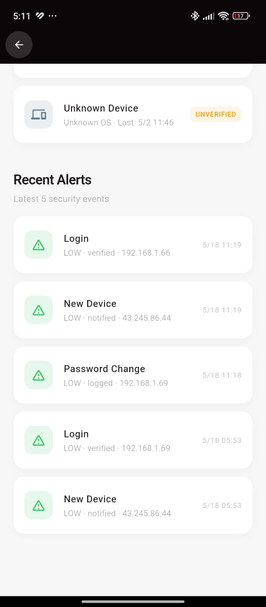 | 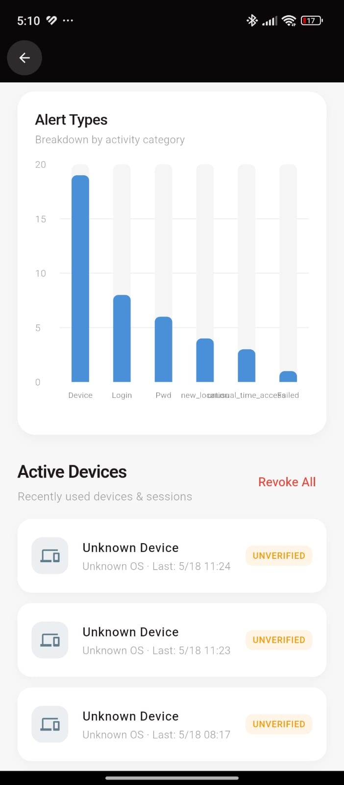 |

| File Insights | Vault Activity |
| --- | --- |
| 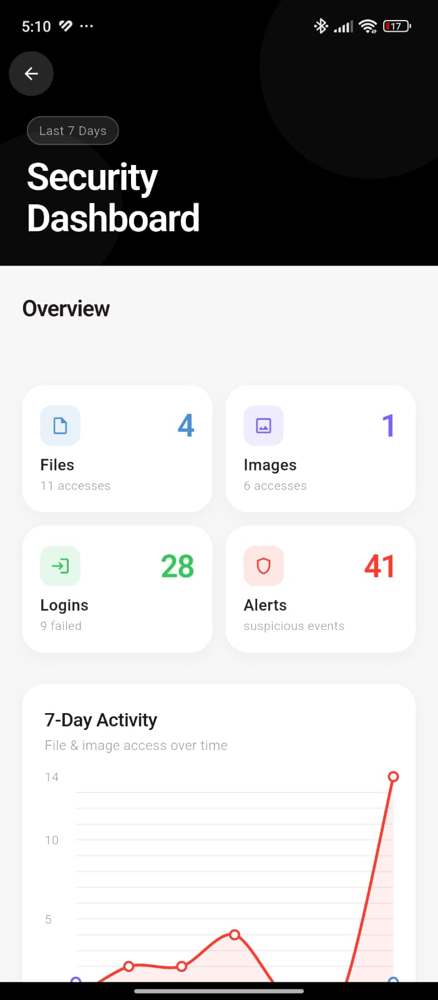 | 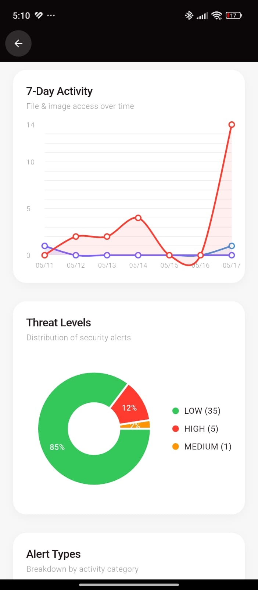 |

| Navigation Drawer | SecureShare |
| --- | --- |
| 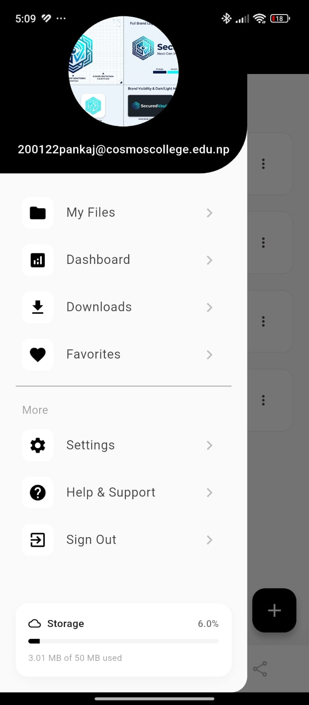 | 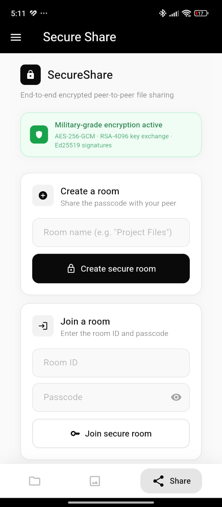 |

| Room Page | File Transfer |
| --- | --- |
| 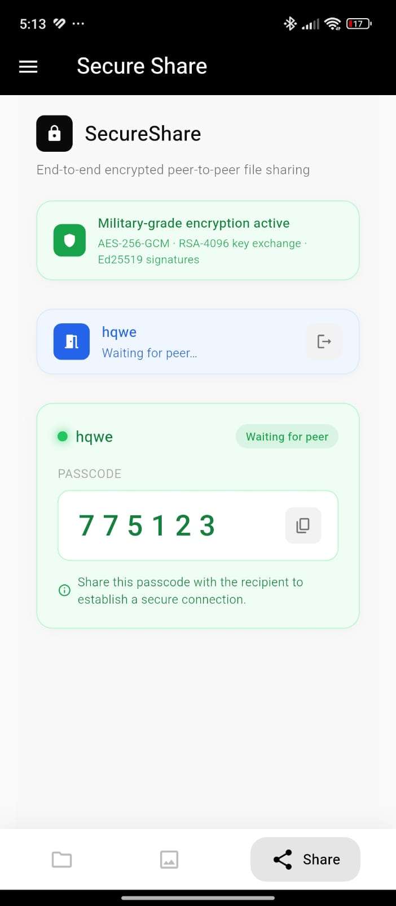 | 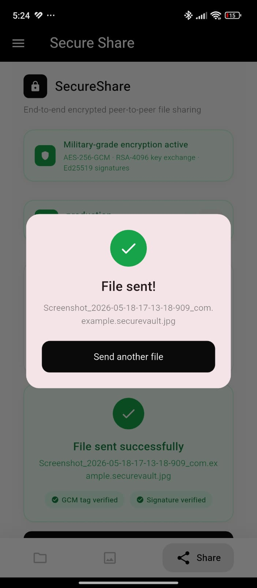 |

| Signature Verification |
| --- |
| 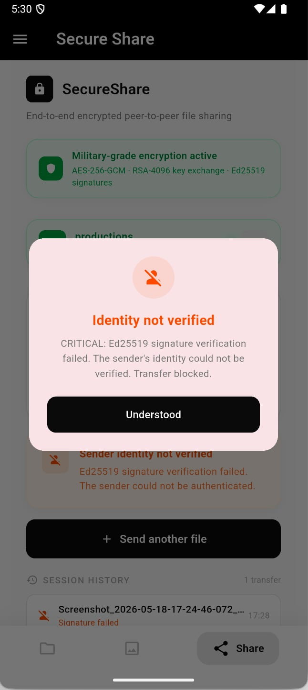 |

## Architecture Diagrams

### High-Level System Design


### Cryptographic Low-Level Design


### SIEM and Security Monitoring Low-Level Design


### WebRTC Transfer State Low-Level Design


## UML and Sequence Diagrams

### System Sequence Diagram


### File Upload Sequence Diagram

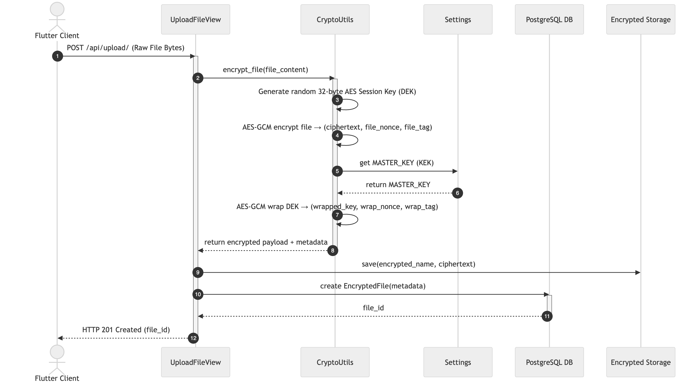

### Download Sequence Diagram


### File Sharing Sequence Diagram


### File Sharing Class Diagram


### File Sharing Class Diagram, Expanded


## Backend Setup

Create a Python environment, install dependencies, configure environment variables, and run the Django API.

```bash
cd Securevaultapi
python -m venv .venv
source .venv/bin/activate
pip install -r requirements.txt
python manage.py migrate
python manage.py runserver 0.0.0.0:8000
```

Minimum local environment variables:

```env
MASTER_KEY=<base64-encoded-32-byte-key>
DB_NAME=<postgres-database>
DB_USER=<postgres-user>
DB_PASSWORD=<postgres-password>
DB_HOST=localhost
DB_PORT=5432
REDIS_URL=redis://127.0.0.1:6379
DEBUG=True
```

Run the ASGI server for WebSocket signaling:

```bash
cd Securevaultapi
daphne Securevaultapi.asgi:application -b 0.0.0.0 -p 8001
```

Run Celery workers when using async alerts and background security jobs:

```bash
cd Securevaultapi
celery -A Securevaultapi worker -l info
```

## Flutter Setup

Install Flutter dependencies and run the mobile app.

```bash
cd securevault
flutter pub get
flutter run
```

The Flutter client currently uses a local debug API URL and a production Render URL in the data source layer. Update the debug base URL if your backend is running on a different host or port.

## Documentation

For the full technical write-up, see [ARCHITECTURE.md](ARCHITECTURE.md). It covers the high-level design, low-level cryptographic flow, WebRTC transfer state, backend monitoring, and operational boundaries in more detail.

## Project Status

SecureVault is a full-stack academic and engineering project focused on secure storage, authenticated sharing, and practical security monitoring. It is intended as a strong foundation for further production hardening, deployment automation, and expanded test coverage.

## Project Walkthrough

Watch the full project walkthrough here: [SecureVault Project Walkthrough](https://drive.google.com/file/d/1y4b4aSa9ctc5ZAFxg7vi9E7-x_ZrXq_2/view?usp=sharing)

