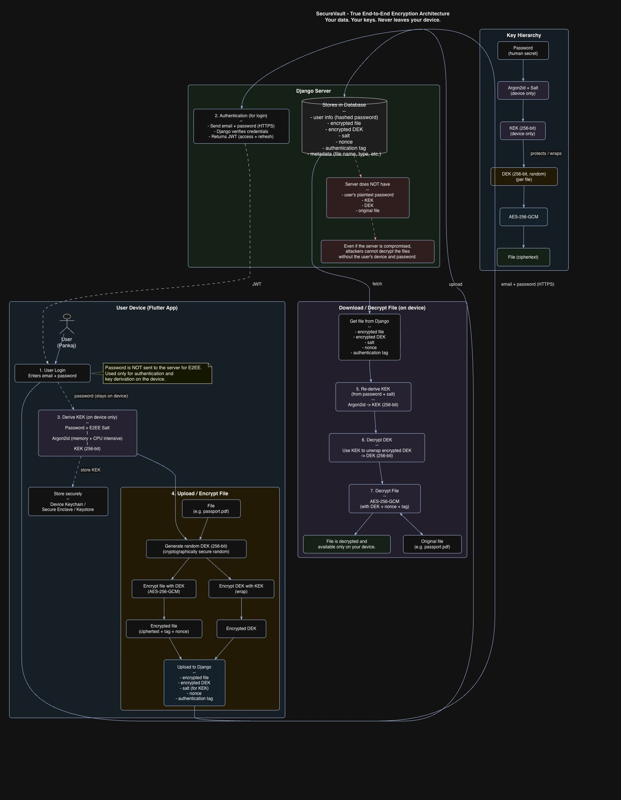

# SecureVault

A file vault with end-to-end encryption. Files are encrypted and decrypted on the user's device only. The backend stores ciphertext and can't decrypt it.



> **Background:** v1 used server-side encryption (SSE) with P2P sharing, integrity checks and threat monitoring. SSE means the server holds the keys, so v2 moves the vault to client-side E2EE. This was an academic project that I'm developing iteratively.

## Security design

### Two independent secrets

| | Login password | Vault password |
|---|---|---|
| Purpose | Authenticate to the API | Derive the key that protects file keys |
| Leaves the device? | Yes (HTTPS) | **No** |
| Server stores | Salted hash | Nothing |

They are deliberately separate. If one password did both jobs, a compromised server could capture it at login and derive the encryption keys. With two, authentication grants access to the *ciphertext* and nothing more.

### Key hierarchy

```
Vault password ──┐
                 ├─► Argon2id ─► KEK (256-bit, never stored on server)
Salt ────────────┘                 │
                                   │ wraps
                                   ▼
                    DEK (256-bit, random, one per file)
                                   │ encrypts
                                   ▼
                    AES-256-GCM ─► ciphertext + nonce + auth tag
```

| Key | Origin | Lives | Role |
|---|---|---|---|
| Vault password | User | User's head | Root secret |
| Salt | Random | Server (not secret) | Makes KEK derivation unique per vault |
| KEK | Argon2id(password, salt) | Device only | Wraps/unwraps DEKs |
| DEK | CSPRNG, per file | Wrapped form on server | Encrypts the file |

**Why two layers (KEK + DEK)?**
- A leaked DEK exposes one file, not the vault.
- Changing the vault password means re-wrapping small DEKs, not re-encrypting every file.
- Each file's encryption is independent of the others.

### Primitives

- **KDF:** Argon2id, memory-hard, which makes offline guessing of the vault password expensive. Parameters: `[memory, iterations, parallelism]`.
- **File encryption:** AES-256-GCM, authenticated encryption, so tampering is detected, not just hidden.
- **DEK wrapping:** `[AES-256-GCM / AES-KW: state which one you used]`
- **Randomness:** cryptographically secure RNG for DEKs, salts and nonces. Nonces are never reused under the same key.
- **Library:** `[e.g. cryptography / pointycastle / cryptography_flutter]`

## Data flow

### Upload
1. User logs in (email + login password) and receives a JWT.
2. User selects a file and enters the **vault password**.
3. App derives `KEK = Argon2id(vault_password, salt)`.
4. App generates a random `DEK` and encrypts the file: `AES-256-GCM(DEK, nonce) → ciphertext + tag`.
5. App wraps the DEK: `encrypted_DEK = Wrap(KEK, DEK)`.
6. App uploads: `ciphertext`, `encrypted_DEK`, `salt`, `nonce`, `tag`, `metadata`.

### Preview / download
1. App fetches the encrypted blob and its parameters from the API.
2. User enters the **vault password**.
3. App re-derives the KEK from the password and stored salt.
4. App unwraps the DEK, then decrypts the file with DEK + nonce + tag.
5. If the tag check fails, decryption is rejected, so no corrupted or modified output is shown.

The vault password is requested for each upload and each preview, so key material exists only while the user is actively working with a file.
`[Confirm: is the KEK held only in memory and cleared after use, or cached in Keychain/Keystore?]`

## Backend

**Stores:** user record (hashed login password), encrypted file, encrypted DEK, salt, nonce, auth tag, file metadata (name, type, size).

**Never receives:** vault password, KEK, DEK, or plaintext file.

**Auth:** JWT (access + refresh), kept separate from the encryption flow.

`[Optional: endpoint table]`

| Method | Endpoint | Purpose |
|---|---|---|
| POST | `/api/auth/login/` | Obtain JWT |
| POST | `/api/files/` | Upload encrypted blob + parameters |
| GET | `/api/files/` | List files (metadata) |
| GET | `/api/files/<id>/` | Fetch encrypted blob + parameters |

## Threat model

| Scenario | Outcome |
|---|---|
| Database or storage leaked | Attacker gets ciphertext, wrapped DEKs, salts. Needs the vault password to go further, and Argon2id slows guessing. |
| Server fully compromised | Same as above. The server never held keys or the vault password. |
| Login password stolen | Attacker can reach the API and download ciphertext, but can't decrypt it. |
| Stored file tampered with | GCM tag verification fails and the file is rejected. |
| Weak vault password | **Not protected.** An offline attack on a weak password is the main remaining risk. |
| Compromised or malicious client device | **Out of scope.** Malware on the device can read the password and plaintext. |
| Malicious server serving a modified app | **Out of scope** for the mobile app. Trust is anchored in the app you built and installed. |

## Limitations

- **No password recovery.** Forget the vault password and the files are unrecoverable. A recovery-key mechanism is something I want to explore.
- **Metadata is not encrypted.** File names, types and sizes are visible to the server.
- **Vault password strength is on the user.** There is currently `[no / basic]` strength enforcement.
- **Not independently audited.** Treat it as a learning project.
- `[Sharing: v1 had P2P sharing. State whether it's ported, planned, or dropped.]`

## Roadmap

- [ ] `[Recovery key at vault setup]`
- [ ] `[Encrypted file names / metadata]`
- [ ] `[Public-key based sharing]`
- [ ] `[Threat monitoring / audit logging]`
- [ ] `[Vault password change via DEK re-wrap]`
